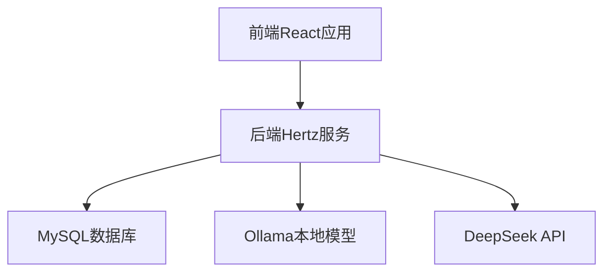

# 上下文工程六要素小工具 (context-engineering-six-elements)

## 项目描述

这是一个基于"上下文工程六要素"理念构建的主题六要素生成工具。该工具旨在帮助用户快速创建结构化的提示词模板，提高与AI交互的效率和准确性。

上下文工程六要素包括：
1. **任务目标** - 清晰描述你希望AI完成的具体任务
2. **AI的角色** - 指定AI扮演的角色
3. **我的角色** - 说明你在任务中的身份
4. **关键信息** - 提供任务必需的背景信息
5. **行为规则** - 定义必须遵守的规则
6. **交付格式** - 指定输出格式

项目地址：[https://github.com/zsy619/cese-qoder](https://github.com/zsy619/cese-qoder)

## 核心功能

- 🔄 **六要素模板生成** - 根据用户输入的主题自动生成完整的六要素提示词模板，帮助用户快速构建高质量的AI提示词
- 💾 **模板保存与管理** - 支持保存生成的模板到本地数据库，便于后续查阅、编辑和重复使用
- 📤 **多格式导出** - 支持将生成的模板导出为Markdown、JSON、TXT等多种格式，满足不同场景的使用需求
- 🔍 **模板搜索** - 提供基于关键词的历史模板搜索功能，方便快速找到相关模板
- 🎨 **友好界面** - 直观的用户界面设计，简化模板创建流程，提升用户体验
- 🧠 **AI集成** - 集成Ollama和DeepSeek大模型接口，提供智能辅助生成功能，提升模板质量
- 📋 **实时预览** - 支持实时预览生成的提示词效果，方便用户及时调整优化
- 📦 **批量处理** - 支持批量生成多个主题的六要素模板，提高工作效率

## 技术栈

### 前端
- React - 用于构建用户界面的JavaScript库
- Vite - 快速的前端构建工具
- Ant Design - UI组件库

### 后端
- Golang - 高性能后端服务语言
- Hertz - 字节开源的高性能Web框架
- GORM - ORM库用于数据库操作

### 数据库
- MySQL - 关系型数据库用于存储模板数据

### AI集成
- Ollama - 本地大模型运行平台
- DeepSeek - 在线大模型API

## 系统架构



## 部署指南

### 环境要求
- Node.js >= 16.0
- Go >= 1.19
- MySQL >= 8.0
- Docker (可选，用于容器化部署)
- Ollama (可选，用于本地模型)

### 源码启动

1. 克隆项目代码：
```bash
git clone https://github.com/zsy619/cese-qoder.git
cd cese-qoder
```

2. 安装前端依赖：
```bash
cd frontend
npm install
```

3. 安装后端依赖：
```bash
cd backend
go mod tidy
```

4. 配置数据库：
```sql
CREATE DATABASE context_engine;
```

5. 启动前端服务：
```bash
cd frontend
npm run dev
```

6. 启动后端服务：
```bash
cd backend
go run main.go
```

### Docker启动

1. 确保已安装Docker和Docker Compose

2. 构建并启动服务：
```bash
docker-compose up -d
```

3. 访问应用：
- 前端：http://localhost:3000
- 后端API：http://localhost:8080

### 云函数启动

1. 准备云函数环境（以阿里云函数计算为例）：

2. 构建函数包：
```bash
cd backend
GOOS=linux GOARCH=amd64 CGO_ENABLED=0 go build -o main main.go
zip function.zip main
```

3. 部署到云函数平台：
- 登录云函数控制台
- 创建函数服务
- 上传function.zip包
- 配置环境变量和触发器

## 使用说明

1. 访问应用界面
2. 输入您想要生成提示词的主题
3. 工具会自动填充六个要素的基本框架
4. 根据需要调整每个要素的具体内容
5. 保存或导出生成的模板

## 贡献指南

欢迎提交Issue和Pull Request来改进这个项目！

1. Fork本项目
2. 创建您的特性分支 (`git checkout -b feature/AmazingFeature`)
3. 提交您的更改 (`git commit -m 'Add some AmazingFeature'`)
4. 推送到分支 (`git push origin feature/AmazingFeature`)
5. 开启一个Pull Request

## 许可证

本项目采用MIT许可证，详情请见[LICENSE](LICENSE)文件。

MIT License

Copyright (c) 2025 context-engineering-six-elements

Permission is hereby granted, free of charge, to any person obtaining a copy
of this software and associated documentation files (the "Software"), to deal
in the Software without restriction, including without limitation the rights
to use, copy, modify, merge, publish, distribute, sublicense, and/or sell
copies of the Software, and to permit persons to whom the Software is
furnished to do so, subject to the following conditions:

The above copyright notice and this permission notice shall be included in all
copies or substantial portions of the Software.

THE SOFTWARE IS PROVIDED "AS IS", WITHOUT WARRANTY OF ANY KIND, EXPRESS OR
IMPLIED, INCLUDING BUT NOT LIMITED TO THE WARRANTIES OF MERCHANTABILITY,
FITNESS FOR A PARTICULAR PURPOSE AND NONINFRINGEMENT. IN NO EVENT SHALL THE
AUTHORS OR COPYRIGHT HOLDERS BE LIABLE FOR ANY CLAIM, DAMAGES OR OTHER
LIABILITY, WHETHER IN AN ACTION OF CONTRACT, TORT OR OTHERWISE, ARISING FROM,
OUT OF OR IN CONNECTION WITH THE SOFTWARE OR THE USE OR OTHER DEALINGS IN THE
SOFTWARE.